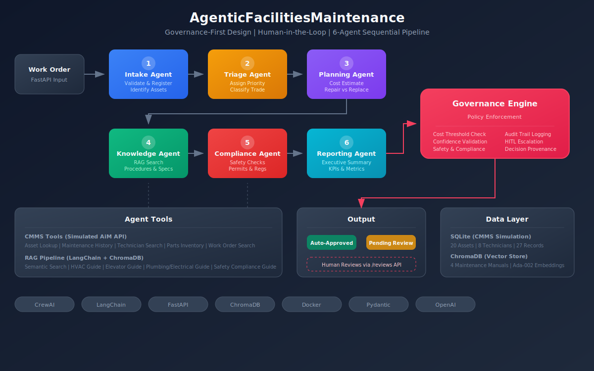

# AgenticFacilitiesMaintenance

An AI-powered Facilities Maintenance Assistant built with a **governance-first** design and **human-in-the-loop** controls. Six specialized AI agents work as a sequential pipeline to analyze, plan, and route maintenance work orders with full audit trail and policy enforcement.

## Architecture



### Agent Pipeline (Sequential Flow)

```
Work Order Input
       |
[1. Intake Agent] ---- Validates request, identifies assets
       |
[2. Triage Agent] ---- Assigns priority and trade (with reasoning)
       |
[3. Planning Agent] -- Analyzes history, estimates cost, creates plan
       |
[4. Knowledge Agent] - Retrieves procedures from maintenance docs (RAG)
       |
[5. Compliance Agent]- Checks safety, permits, regulations
       |
[6. Reporting Agent] - Generates executive summary
       |
[Governance Engine] -- Evaluates policies, triggers HITL if needed
       |
Output: Approved or Pending Human Review
```

### Governance-First Design

Every agent decision is logged to an audit trail. The Governance Engine evaluates completed work orders against configurable policies:

| Policy | Trigger | Action |
|--------|---------|--------|
| Cost Threshold | Estimated cost > $5,000 | Human approval required |
| Critical Priority | Safety or emergency | Human confirmation required |
| Equipment Replacement | Agent recommends replacing an asset | Human sign-off required |
| Low Confidence | Agent confidence < 0.7 | Human verification required |
| Compliance Flag | Safety permits or regulatory requirements | Mandatory review |

### Human-in-the-Loop Flow

```
Agent recommends action
       |
Governance Engine evaluates
       |
   [Policy check]
    /         \
Passes       Triggers HITL
   |              |
Auto-approve  Status: pending_human_review
                  |
           Human reviews via API
            /           \
       Approve         Reject
           |              |
     Execute work    Return for revision
```

## Tech Stack

| Component | Technology | Purpose |
|-----------|-----------|---------|
| Multi-Agent Orchestration | CrewAI | Sequential agent pipeline |
| RAG Pipeline | LangChain + ChromaDB | Maintenance document intelligence |
| Embeddings | OpenAI Ada-002 | Vector embeddings for semantic search |
| API Layer | FastAPI | REST endpoints with Swagger docs |
| Data Validation | Pydantic | Type-safe data models |
| Database | SQLite | Simulated CMMS (AiM) data store |
| Containerization | Docker | Production-ready deployment |

## Getting Started

### Prerequisites

- Python 3.11 or higher
- OpenAI API key

### Installation

```bash
# Clone the repository
git clone https://github.com/Dewale-A/AgenticFacilitiesMaintenance.git
cd AgenticFacilitiesMaintenance

# Create virtual environment
python -m venv venv
source venv/bin/activate  # On Windows: venv\Scripts\activate

# Install dependencies
pip install -r requirements.txt
# Or with Poetry:
poetry install

# Set up environment
cp .env.example .env
# Edit .env and add your OPENAI_API_KEY
```

### Running the Server

```bash
python run_server.py
```

The server starts at `http://localhost:8000`. API documentation is available at `http://localhost:8000/docs`.

### Running with Docker

```bash
# Set your API key
export OPENAI_API_KEY=your-key-here

# Build and run
docker-compose up --build
```

## API Endpoints

### Work Orders
| Method | Endpoint | Description |
|--------|----------|-------------|
| POST | `/work-orders` | Submit a new work order (async) |
| POST | `/work-orders/sync` | Submit and process synchronously |
| GET | `/work-orders` | List all work orders |
| GET | `/work-orders/{id}` | Get work order details |

### Human-in-the-Loop Reviews
| Method | Endpoint | Description |
|--------|----------|-------------|
| GET | `/reviews/pending` | List work orders pending review |
| POST | `/reviews/{id}/approve` | Approve an escalated work order |
| POST | `/reviews/{id}/reject` | Reject an escalated work order |

### Governance
| Method | Endpoint | Description |
|--------|----------|-------------|
| GET | `/governance/audit-trail/{id}` | Full decision audit trail |
| GET | `/governance/dashboard` | Governance overview and stats |

### Assets
| Method | Endpoint | Description |
|--------|----------|-------------|
| GET | `/assets` | List all assets |
| GET | `/assets/{id}` | Asset details |
| GET | `/assets/{id}/history` | Asset maintenance history |

### System
| Method | Endpoint | Description |
|--------|----------|-------------|
| GET | `/health` | Health check |
| GET | `/stats` | System statistics |

## Example: Submit a Work Order

```bash
curl -X POST http://localhost:8000/work-orders/sync \
  -H "Content-Type: application/json" \
  -d '{
    "title": "HVAC unit making loud vibrating noise",
    "description": "The air handling unit in the Science Building basement has been vibrating loudly for 2 days. Temperature in labs on floors 1-3 is rising above comfortable levels. Faculty have complained.",
    "building": "Science Building",
    "floor": "B1",
    "room": "Basement Mechanical",
    "requester_name": "Dr. Sarah Johnson",
    "requester_email": "sjohnson@university.edu",
    "asset_id": "AHU-B12-01"
  }'
```

This work order will trigger the full agent pipeline. Given the asset history (4 repairs in 12 months, $7,950 total), the Planning Agent will likely recommend replacement, which triggers human review via the governance engine.

## Project Structure

```
AgenticFacilitiesMaintenance/
├── README.md                    # You are here
├── docs/
│   └── architecture.svg         # System architecture diagram
├── src/
│   ├── agents/
│   │   └── definitions.py       # 6 agent definitions (role, goal, backstory)
│   ├── tasks/
│   │   └── definitions.py       # Task templates for each agent
│   ├── tools/
│   │   ├── cmms_tools.py        # CMMS database query tools
│   │   └── rag_tools.py         # RAG search tools (LangChain + ChromaDB)
│   ├── data/
│   │   └── database.py          # SQLite setup, seed data, query helpers
│   ├── docs/                    # Maintenance manuals for RAG
│   │   ├── hvac_maintenance_guide.md
│   │   ├── elevator_maintenance_guide.md
│   │   ├── plumbing_electrical_guide.md
│   │   └── safety_compliance_guide.md
│   ├── models/
│   │   └── schemas.py           # Pydantic data models
│   ├── governance/
│   │   └── engine.py            # Governance engine (policy enforcement, HITL)
│   ├── api/
│   │   └── routes.py            # FastAPI endpoints
│   └── crew.py                  # Crew orchestration (ties everything together)
├── run_server.py                # Server launcher
├── Dockerfile                   # Container build
├── docker-compose.yml           # Container orchestration
├── pyproject.toml               # Dependencies
└── .env.example                 # Environment template
```

## Key Design Decisions

1. **Governance-First**: The governance engine is not an afterthought. It's a core component that every work order passes through. This mirrors how responsible AI should be deployed in regulated environments.

2. **Human-in-the-Loop**: Configurable escalation policies let organizations dial the level of human involvement up or down. Start conservative, increase autonomy as trust builds.

3. **Audit Trail**: Every agent decision is logged with reasoning, confidence, and data sources. An auditor can trace exactly how and why decisions were made.

4. **Sequential Pipeline**: Agents run in order because each builds on the previous one's output. The Planning Agent needs the Triage Agent's priority. The Compliance Agent needs the Planning Agent's plan.

5. **Tool Isolation**: Each agent only gets the tools it needs (principle of least privilege). The Triage Agent can look up assets but cannot modify work orders directly.

6. **Simulated CMMS**: SQLite simulates a real CMMS (AiM by AssetWorks) so the project runs without external dependencies. In production, swap the database queries with AiM API calls.

## Simulated Data

The database is seeded with realistic facilities data:
- **5 buildings** on a university campus
- **20 assets** (HVAC, elevators, plumbing, electrical, fire safety)
- **8 technicians** with different trade specialties
- **27 maintenance records** with intentional patterns (e.g., AHU-B12-01 has recurring failures)
- **4 maintenance manuals** covering HVAC, elevator, plumbing/electrical, and safety compliance

## License

MIT
